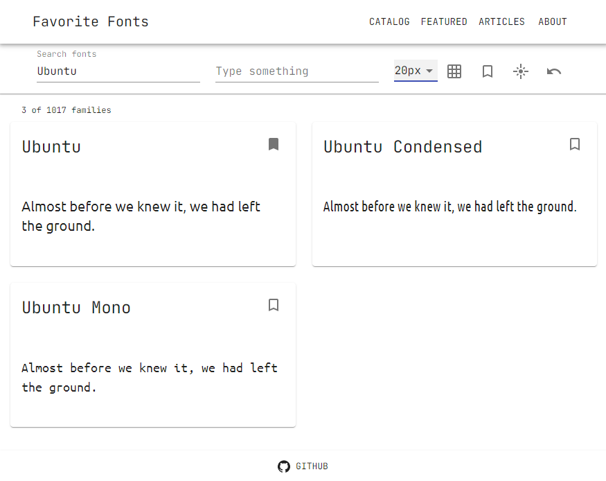

# Favorite Fonts

## Overview

This is a font selection app.

#### DEMO - https://favorite-fonts.aleksey-vl-ivanov.com

<div align="center">

</div>

## Features

- the app tries to mimic some [Google Fonts](https://fonts.google.com) features
- the [Google Fonts API](https://developers.google.com/fonts/docs/getting_started) and the [Google Fonts Developer API](https://developers.google.com/fonts/docs/developer_api) are used
- only fonts with regular variant and latin subset sorted by popularity are fetched for simplicity
- filter fonts by name
- custom text to display
- different font sizes
- add font to favorites
- grid/list, light/dark, all/favorites modes with reset
- back to top smooth scrolling
- responsive layout

## Dependencies

- React plus hooks bootstrapped with CRA
- [axios](https://github.com/axios/axios) for AJAX
- styling with [Material-UI](https://material-ui.com)
- [react-lazyload](https://github.com/twobin/react-lazyload) for loading fonts on request

## Install

```
$ git clone ...
$ cd favorite-fonts
$ npm install
$ echo "REACT_APP_WEBFONTS_KEY=<YOUR-GOOGLE-WEBFONTS-API-KEY-HERE>" >> .env.local
```

## Usage

```
$ npm start
```

and open http://localhost:3000 in your browser, or

```
$ npm run build
```

and deploy somewhere your new **build** folder. Don't forget to set the **REACT_APP_WEBFONTS_KEY** variable in your GitHub Secrets, Heroku/Netlify Vars, etc.

## Ideas

- The app idea was taken from [Chingu](https://www.chingu.io) [Solo Project - Tier 2](https://github.com/chingu-voyages/soloproject-tier2-favfonts). They asked do not use **Google Web Font Loader**, so we should definitely take it for better approach.
- Use **Effector/Mobx/Redux** for state management.
- Apply **react-window** and **react-window-infinite-loader** for more efficient rendering large lists as **react-lazyload** has some visual glitches.
- Refactor the app to break it down into smaller components.
- Add more features from [Google Fonts](https://fonts.google.com).
